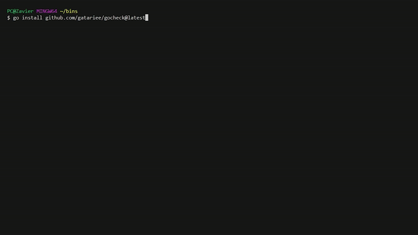
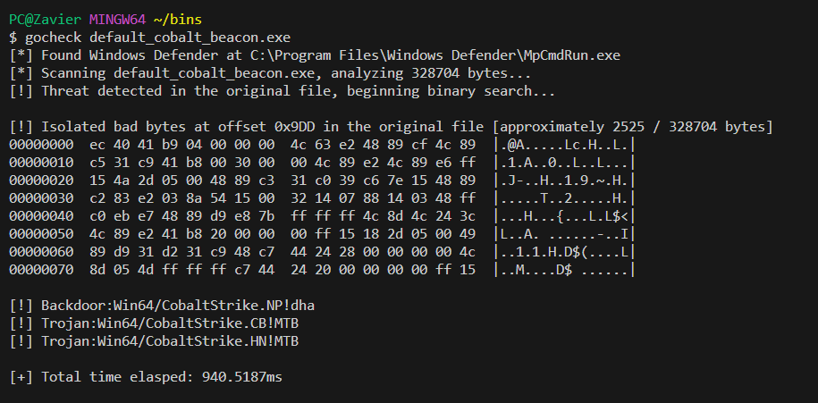
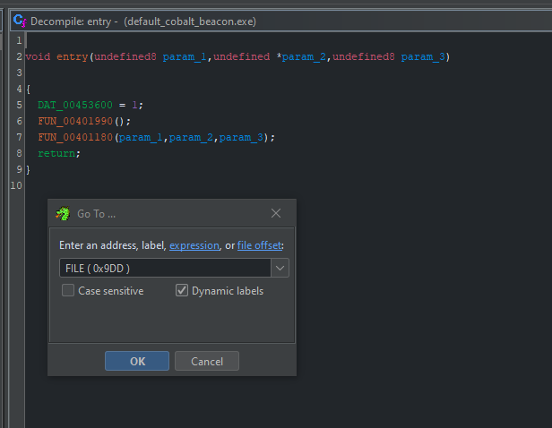
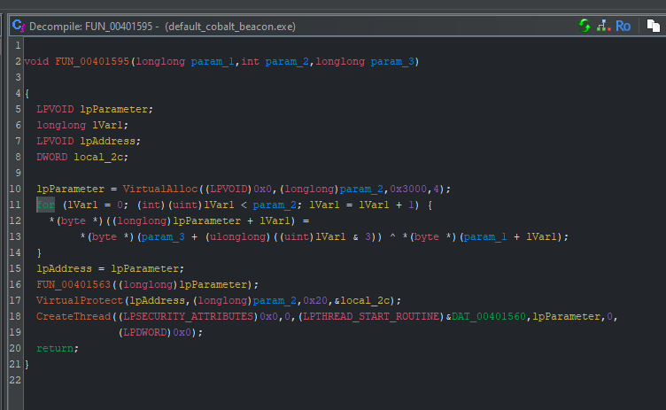

# GoCheck
GoCheck a blazingly fast™ alternative to Matterpreter's [DefenderCheck](https://github.com/matterpreter/DefenderCheck) which identifies the exact bytes that Windows Defender AV by feeding byte slices to `MpCmdRun.exe`

I also wrote a blog post showcasing this project: [Identifying Malicious Bytes in Malware](https://gatari.dev/posts/identifying-malicious-bytes-in-malware/)



## Usage
```cmd
$ gocheck check --help
Usage:
  gocheck check [flags]

Flags:
  -a, --amsi          Use AMSI to scan a file
  -d, --defender      Use Windows Defender to scan a binary
  -f, --file string   Binary to check
  -h, --help          help for check
```

## Quick Use
The `check` cobra flag is only used for ease of extensibility in the event that I finally decide to integrate [Ghidra's Headless Analyzer](https://static.grumpycoder.net/pixel/support/analyzeHeadlessREADME.html) with `gocheck`. For ease of use, you can actually completely omit the `check` flag and directly pass the file to `gocheck` as an argument.

```cmd
$ gocheck <file> /optional:args
```

> This may be changed in the future.

## Windows Defender


## Installation
You can install `gocheck` from `go install`
```bash
go install github.com/gatariee/gocheck@latest
```

Alternatively, you can download the precompiled binaries from the [releases](https://github.com/gatariee/gocheck/releases) or build it yourself.
```bash
git clone https://github.com/gatariee/gocheck
make [ windows / win64 / win32 ]
```

### Evasion Usage
You can use `gocheck` to identify bad bytes, and then pass the identified offset of bad bytes into [ghidra](https://github.com/NationalSecurityAgency/ghidra) (or, any other decompiler) to hopefully decompile the binary and locate the bad bytes in a function.

I'll be using `ghidra` to decompile the binary since I'm more familiar with it. (and, it's free)
#### 1. Check for Bad Bytes
```cmd
$ gocheck <file> /optional:args
```


* Identified bad bytes at offset **0x9DD** (from start of binary)
* 16 bytes **before & after** the bad bytes are also printed for context, but doesn't help much in this case.

#### 2. Open the binary in Ghidra
* Navigation -> Go To... -> **FILE ( 0x9DD )**
  * Alternatively, `G` also brings up the same dialog.



* The bad bytes are identified after a call to `VirtualAlloc` and before a call to `VirtualProtect` in this case, which should be easy to find in the artifact kit.



## Benchmark
> ⚠️ I am not an expert in benchmarking, and the following benchmarks are conducted on a single machine, and the results may vary on different machines. The benchmarks are conducted on a single machine to provide a rough estimate of the performance difference between `gocheck` and `DefenderCheck`.

The objective of `gocheck` was to implement a faster alternative to Matterpreter's [DefenderCheck](https://github.com/matterpreter/DefenderCheck) as I realized that it was painfully slow when scanning large binaries, which can be quite a headache for extremely large binaries such as those written in Golang.

The following benchmarks were conducted on the following specifications:
* **OS**: Windows 10 Pro
* **CPU**: AMD Ryzen™ 5 3600X
* **RAM**: 32 GB DDR4 3200 MHz

The I/O operations were conducted on a Samsung 870 EVO SATA 2.5" SSD (1 TB), 560/530 MB/s R/W, the temporary binaries are stored in the `C:\Temp` directory.

### mimikatz.exe (1,250,056 bytes / 1.19 MB)

| Tool | Time |
|------|------|
| GoCheck | 1.05s |
| DefenderCheck | 5.56s |


### Sliver HTTP Beacon (10,972,160 bytes / 10.4 MB)

| Tool | Time |
|------|------|
| GoCheck | 5.65s |
| DefenderCheck | 35.69s |


## Credits / References
* Originally implemented by [Matterpreter](https://github.com/matterpreter) in [DefenderCheck](https://github.com/matterpreter/DefenderCheck)
* https://github.com/rasta-mouse/ThreatCheck
