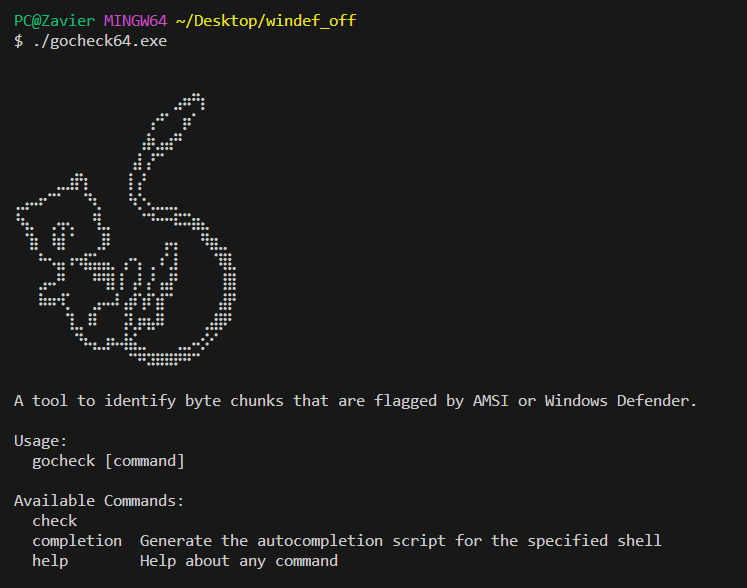

# GoCheck
> Heavily inspired by [ThreatCheck](https://github.com/rasta-mouse/ThreatCheck) and [DefenderCheck](https://github.com/matterpreter/DefenderCheck)

GoCheck is a tool for identifying exact bytes that are flagged by Windows Defender by splitting a file into chunks and feeding them to `MpCmdRun.exe`.




## Usage
```cmd
$ ./GoCheck64.exe check --help
Usage:
  gocheck check [flags]

Flags:
  -a, --amsi          Use AMSI to scan the binary
  -d, --defender      Use Windows Defender to scan the binary
  -f, --file string   Binary to check
  -h, --help          help for check
```

## Installation
Download the latest release from the [releases](https://github.com/gatariee/GoCheck/releases), or build it from source.
```bash
git clone https://github.com/gatariee/GoCheck
cd gocheck/src
make windows
```
